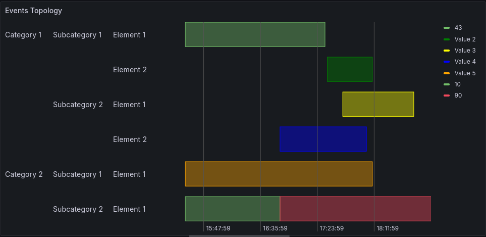

# Events Topology

## Overview / Introduction

This plugin can display events associated to nested categories (the topology).

The topology is extracted from events names by splitting them using a
configurable separator.
